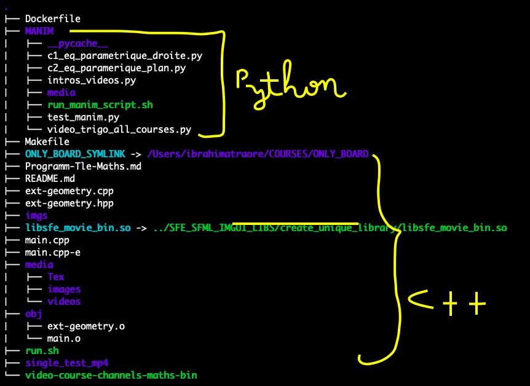

<h1 style="border:2px solid; text-align:center;color:blue">API_MATHS</h1>

<h4><p style="color:orange">DESCRIPTION:</p> This is boards application for maths vido course</h4>

<h4 style="color:orange">Arborescence</h4>
<div><br/>As you can see, i have symbolic link to link the created library ../SFE_SFML_IMGUI_LIBS/create_unique_library/libsfe_movie_bin.so<br/>We can notice that the rpositoy is compose of Python scipts[aka MANIM] directory, C++ scripts and Dockerfile</div>

<h4 style="color:orange">Why this arborecence ?</h4>
<ol>
<li>
	<h4>Dockerfile</h4>
	<span>Inside the Dockerfile, we load Manim docker image because to generate video mp4 with Manim python script, we will work inside dockr container. So make sure your docker engine has started.</span>
	<pre>load your docker manim image[If it does not yet exists]<br/>docker build . -t manim_image <br/>OR<br/>source run.sh build</pre>
	<pre>REPOSITORY    TAG       IMAGE ID       CREATED          SIZE
manim_image   latest    b4e1b47b59a2   11 seconds ago   2.24GB</pre>
</li>
<li><h4>MANIM directory (python scripts to build mp4 vido)</h4></h4>
<ol><li>Create your manim scene. You have some exampleinside  python script:intros_videos.py - c1_eq_parametique_droite.py - c2_eq_paramerique_plan.py ...</br></br></li>
<li>Shell Script tu run python script inde container and generate mp4 video:
<pre>source run_manim_script my_manim_python_scene_file.py</pre></li></ol>
</li>
</ol>


#### [STEP 4 / 4 : Maths the extern part]
#### ************************************************
####
#### ~/COURSES/API_MATHS or MY_CHANNELS_MATHS
####
#### 
#### *************************************************

```
This API is composed of symbolic link 
towards MY_CHANELS_GENERIC and external geometry files
called ext-geometry.cpp and ext-geometry.hpp
```

```
INFO: 
You can do your additive staff inside those geometry files.
Please, do not change the geometry files name.

If you use imgui-editor, please make sure your cursor lies
on editor screen so that editor mouseover event will prevent
sfml-event like f:for fullscreen etc ...

If you don't do it, when you type for example "f" inside editor, it won't appear but instead , you will see fullscreen.
```
###### HOW TO RUN ?

```
Please, set these Macro used by the following class in board-ext-geometry.hpp

	#define EXTERN_BACKGROUND_CHOSEN_COLOR BLACK
	#define EXTERN_MENU_SHAPE_COLOR BLACK 
	#define EXTERN_SCREEN_STROKE_COLOR WHITE
```

```
Please, set these Macro used by the following class in board-only.hpp

#define SHOW_IMGUI_TEXT_EDITOR true
#define IMGUI_EDITOR_CHARACTER_SIZE 1.5f //if you use 1.5f , it will increase default imgui-character size of 50%

```

#### =|=> MANIM DIRECTORY

```
1- build your manim scene : 
	
	source run.sh MANIM_DIR/mypython_script.py 

Fill free to check the new generated mp4 files, so runs :

open media/videos/path/to/mp4/files
```

```
2- Save your mp4 generated files: 

	source run.sh save

It will save the new generated scene, which lies inside shared directory called media 
(shared directory between host and docker, because here MANIM runs his script inside docker)
into DiskE and at the same time 
export the DiskE path (Exemple export VOLUME_VIDEOS_PHYSICS_PATH=/Volumes/DiskE/VIDEOS-Tle-Physics-mp4/dynamic/) into 
~/.bashrc file (because if we export simply, the variable will be lost after)

So, while running c++, it will load dynamically all mp4 files  from thate expoted variable.
No need to set manually , mp4 files names (as in old days)
```

```
3- C++ to run your scnene: 

	make re 
	or 
	make fclean ...

You have somes others options: so run :

source run.sh

to see all available option.
```

###### IMPORTANT NOTE
```
After you've run MANIM to generate your mp4 files, 
Simply save the files inside DiskE and update

if you run : 
source run.sh save, 
the script will save the mp4 file inside current DiskE directory (exemple: /Volumes/DiskE/VIDEOS-Tle-Maths-mp4/ext-geometry/parametric/plan//Equation_Cartesienne_Plan_4.mp4) and save permanently that file into a variable called VOLUME_VIDEOS_PATH (inside ~/.bashrc)
```

```
Now if you run your c++, it will first load each mp4 files dynamically from that directory .

by inserting the suitables courses mp4 files. 
```


### PATH
```
cd ~/COURSES/MY_CHANELS_GENERIC
```

##### CREATE DIFFERENTS SYMBOLIK LINK [IF THEY DON'T YET EXISTS ]
```
1- To create ONLY_BOARD and SFE_SFML_LIBS_SYMLINK and libsfe_movie_bin.so symbolics link: 

    RUN: source run.sh symol

    >> This will create two links to ONLY_BOARD and with SFE_SFML_LIBS links called respectively ONLY_BOARD_SYMLINK , SFE_SFML_LIBS_SYMLINK and libsfe_movie_bin.so
```

```
    Nota: Be sure the library libsfe_sfml_imgui_bin.so has already been created inside SFE_SFML_LIBS. If not 
    go to SFE_SFML_LIBS/basic_all_in_one and run: make -f Makefile_build_sfe_sfml_imgui_lib re
    >> Afer that rerun command: source run.sh symol
```

```
=> IMPORTANT: To use this API: 
please clone it and add your own 
ext-geometry.hpp and ext-geometry.cpp 
and add your mp4 files inside 
ONLY_BOARD_GENEIC/board-ext-geometry.cpp 
by updating variable 
const char *EXT_MP4_FILES_ARRAY[] = { ... }
```


### DOCUMENTATION AND USEFULS LINKS:
manim: https://docs.manim.community/en/stable/index.html

### HOW TO RUN THIS SOTWARE
````
-+- TEST MODE or REAL COURSE MODE (MACRO aka #define):

*=> To simply test a mp4 file : 
do not mount /Volume/DiskE, the script 
is so intelligent to detect it

*=> If you need real mode course, 
because the course mp4 file are inside /Volume/DiskE, simply mount the DiskE into your PC

------

*=> NUM_RENDER_WINDOWS: the macro which indicates the number of windows to open (default is 3), this macro is inside ONLY_BOARD/board-gpu.hpp 
````

```
>> THE MENU:

```
 Shortcuts: SFE-MOVIES-MENU
	.... Space - Play / pause 
	.... S - Stop 
	.... R - Reset 
	.... H - Hide / show user controls and mouse cursor
	.... F - Toggle fullscreen 
	.... I - Log media info and current state 
	.... Alt + V - Select next video stream 
	.... Alt + A - Select next audio stream 
	.... Alt + S - Select next subtitle stream 
	.... Alt + P - Music Volume + 
	.... Alt + M - Music Volume - 
    .... [No Shortcut for timeline]:simply click inside and move mouse cursor
```

######  DES LIENS UTILS:
###### [Physic-Maths] https://talkingphysics.wordpress.com/2019/01/08/getting-started-animating-with-manim-and-python-3-7/

###### site Maths Myriam: https://www.annales2maths.com/e3c2-2019-2020/

###### https://docs.manim.community/en/stable/tutorials/quickstart.html#transforming-a-square-into-a-circle


###### https://azarzadavila-manim.readthedocs.io/en/latest/geometry.html#rectangle


###### class definition: https://docs.manim.community/en/stable/reference/manim.mobject.graphing.coordinate_systems.CoordinateSystem.html

###### Youtube: https://www.youtube.com/watch?v=MOv6yN7b2aI&list=PLWOlLjdyZm2NQD1YZmEPB0dwbd0yKINAT&index=1

###### convert to gif 
https://www.zamzar.com/uploadComplete.php?session=5111fb3e3738c3a399ab6b6d77266e98&tcs=Z85

###### AnimatedGIFS: code source origin:
    https://github.com/SFML/SFML/wiki/Source:-Animated-GIF


###### Imgui-SFML: 
	https://github.com/SFML/imgui-sfml
